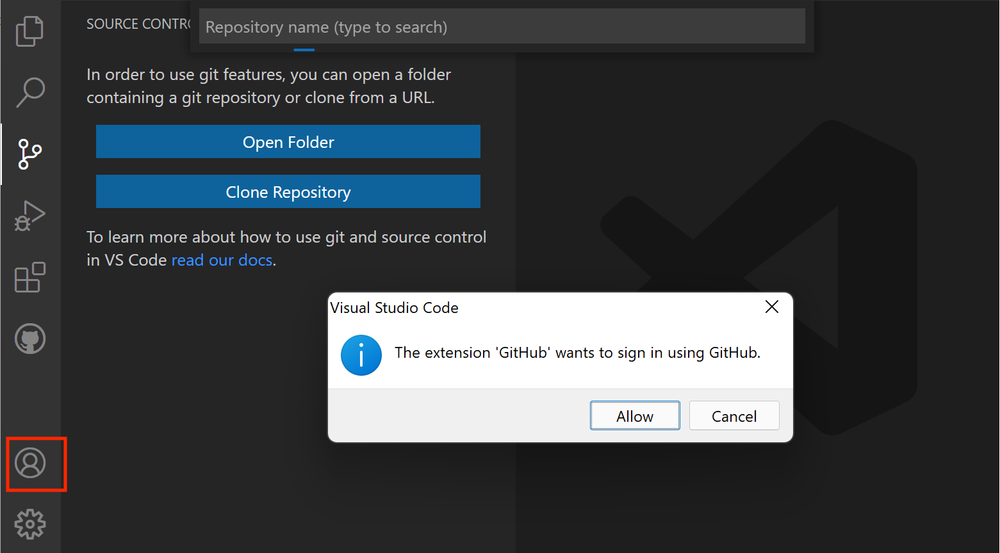

# Setup

Starting from scratch? You're in the right place. This page includes everything
from [Before You Arrive](00-before-you-arrive.md), plus the configuration we'll
do together. You don't need to read or complete that page first.

Each step explains how to check what you already have and what to do if
something is missing. Follow the instructions for your operating system.
If you get stuck, flag down Rolando or Rosty.

## 1. Do you have a GitHub account?

**Yes:** Sign in to your existing account at [github.com](https://github.com),
then continue to **Step 2**.

**No:** Create an account:

1. Go to [github.com](https://github.com) and click **Sign up**.
2. Use a personal, school, or work email address — any is fine.
3. Pick a username you're comfortable sharing publicly and keeping beyond
   this class.

## 2. Can you launch VS Code?

We'll use Visual Studio Code (VS Code) to edit plain-text files and work with
Git through its built-in Terminal and Git controls.

Try opening **Visual Studio Code** from Applications on macOS or the Start
menu on Windows.
* **It opens:** You're ready for **Step 3**. You don't need to reinstall it.
* **It's installed but won't open:** Ask Rolando or Rosty for help before reinstalling it.

### If you don't have it: Follow the installation instructions below.

Download the version for your operating system (Windows or macOS) from [code.visualstudio.com](https://code.visualstudio.com/).

### macOS

- Open the downloaded file and drag **Visual Studio Code** into your **Applications** folder.
- Open it once from Applications to confirm it launches.

### Windows:
Run the installer. Make sure the following options are checked when installing VS Code:
- Add "Open with Code" action to Window Explorer file context menu
- Add "Open with Code" action to Windows Explorer directory context menu
- Register Code as an editor for supported file types
- Add to PATH

Once installation finishes, open **Visual Studio Code** from the Start menu
to confirm it launches.

## 3. Install Git

**First, check whether you already have Git.** Open **Terminal** on macOS
(`Cmd + Space`, type `Terminal`, press Enter) or **PowerShell** on Windows
(open the Start menu, type `powershell`, select **Windows PowerShell**).
Type this command and press Enter:

```
git --version
```

**If you see a version number:** Git is installed. You don't need to re-install
it. Continue to **Step 4**.

**Otherwise, if you see an installation prompt or a message that the command wasn't found:**
Follow the instructions for your operating system below.

### macOS

Git comes with Apple's Command Line Developer Tools. If running
`git --version` opens a dialog offering to install them:

1. Click **Install** and accept the license. This installs Git on your Mac.
2. Wait for installation to finish. Allow 10 minutes or more on slower
   connections; we've built in time for setup.
3. Run `git --version` again in Terminal. If you see a version number,
   you're ready for **Step 4**.

If no installation dialog appears or you still don't see a version number
after installing, ask Rolando or Rosty for help.

### Windows:
The installer can be found at https://git-scm.com/install. I recommend downloading the standalone installer. There will be a few download options, but most machines will want the x64 version. If you're not sure, you can easily determine this. Go to Settings -> System, then scroll all the way down and click on About. The information will be under System type. Once you have that figured out, download the setup tool and start the installer.

Please take your time when clicking through these options, because we will set some specific settings for some of them - consult the screenshots throughout the process. The first set of options aren't super important, but **pay attention when the installer asks you to set the default editor for Git** -- the default option is `vim`, which is an advanced text editor, but you can switch this to VS Code which we installed earlier.
 

I recommend clicking "Next" for all of the options that follow until you get to "Configuring the terminal emulator to use with Git Bash". 
 

Here, please set "Use Windows' default console window". Then continue hitting
"Next" to finish the installation.

Close and reopen **PowerShell**, then run:

```
git --version
```

**You see a version number:** Git is ready. Continue to **Step 4**.

**The command still isn't recognized:** Ask Rolando or Rosty for help before
continuing.

## 4. Tell Git who you are

Git attaches a name and email to every commit you make. First, check whether
these are already set by running these commands in Terminal or PowerShell,
one line at a time:

```
git config --global user.name
git config --global user.email
```

**If both show the name and email you want to use:** Continue to **Step 5**.
You don't need to set them again.

**Otherwise, if either is blank or needs changing:** Run the corresponding command below,
replacing the example with your own name or the email you used for GitHub:

```
git config --global user.name "Your Name"
git config --global user.email "you@example.com"
```

No output means it worked. You can check with:

```
git config --global user.name
git config --global user.email
```

## 5. Sign in to GitHub inside VS Code

1. Open **VS Code**.
2. Click the **Accounts** icon  in the bottom-left corner of the window,
   just above the gear icon.

**If the Accounts menu lists the GitHub username you recognize:** You're
already signed in to GitHub in VS Code. If you've completed **Steps 1–4**,
continue to [Your First Repository](03-first-repo.md).

**Otherwise, if your GitHub account isn't listed:** Sign in with the same account you used
in **Step 1**:

1. If **Sign in with GitHub** is available, select it. 
2. If VS Code asks permission to sign in using GitHub, click **Allow**.
3. Follow the browser prompts to sign in and authorize VS Code using your
   existing GitHub account.
4. Return to VS Code and check the **Accounts** menu for your GitHub username.



*Example sign-in prompt from the [VS Code documentation](https://code.visualstudio.com/docs/sourcecontrol/github#sign-in-to-github-for-git-operations).
Your window may look slightly different.*

This lets VS Code push and pull on your behalf without you typing a password
every time.

---

Everyone caught up? On to [Your First Repository](03-first-repo.md).
