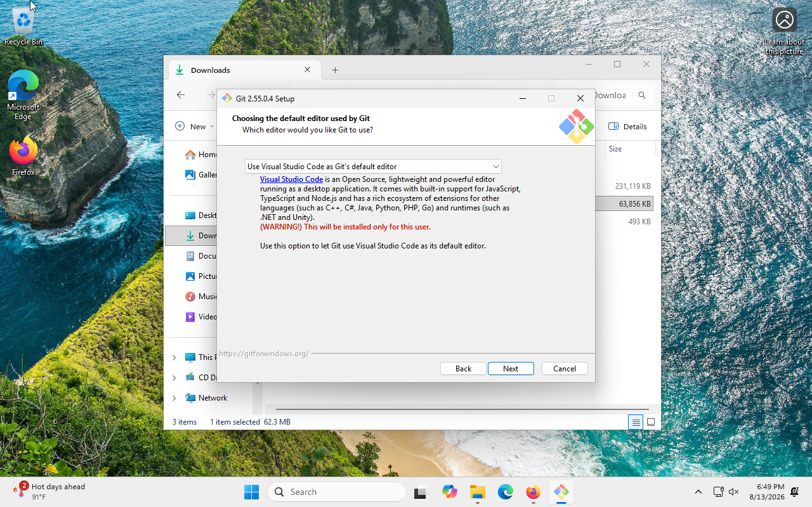
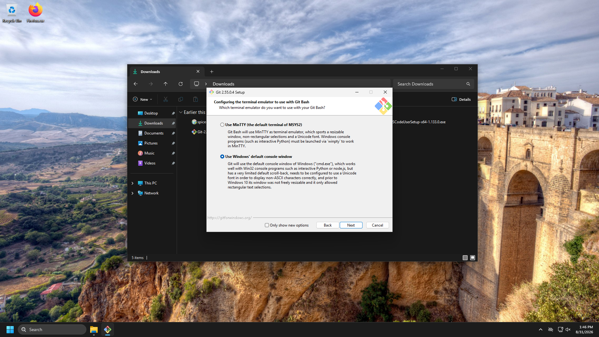

# 2. Setup

We'll get everyone to the same starting point together — nothing needed in
advance. If you already did some of this in
[Before You Arrive](00-before-you-arrive.md) (or already had a GitHub account
or VS Code installed), skip straight to whichever step you still need.

## 1. Create a GitHub account (skip if you already have one)

1. Go to [github.com](https://github.com) and click **Sign up**.
2. Use whatever email address you're comfortable using for this — personal or
   work, either is fine.
3. Pick a username you're comfortable sharing publicly and using beyond
   this class.

## 2. Install VS Code (skip if you already have it)

We'll use [Visual Studio Code](https://code.visualstudio.com/) (VS Code) as
our editor. It has a built-in Terminal and Git controls to make working with
Git and writing plain-text files easier. You'll also need to install Git,
as described below.

First, Go to [code.visualstudio.com](https://code.visualstudio.com/) and download
the correct version for your operating system (Windows or MacOS).

### MacOS:
- Open the downloaded file and drag **Visual Studio Code** into your
   **Applications** folder.
- Open it once from Applications to confirm it launches.

### Windows:
Run the installer. Make sure the following options are checked when installing VS Code:
- Add "Open with Code" action to Window Explorer file context menu
- Add "Open with Code" action to Windows Explorer directory context menu
- Register Code as an editor for supported file types
- Add to PATH

## 3. Install Git

### MacOS
The installation is simpler, check out the next section.

### Windows:
The installer can be found at https://git-scm.com/install. I recommend downloading the standalone installer. There will be a few download options, but most machines will want the x64 version. If you're not sure, you can easily determine this. Go to Settings -> System, then scroll all the way down and click on About. The information will be under System type. Once you have that figured out, download the setup tool and start the installer.

Please take your time when clicking through these options, because we will set some specific settings for some of them - consult the screenshots throughout the process. The first set of options aren't super important, but **pay attention when the installer asks you to set the default editor for Git** -- the default option is `vim`, which is an advanced text editor, but you can switch this to VS Code which we installed earlier.
 

I recommend clicking "Next" for all of the options that follow until you get to "Configuring the terminal emulator to use with Git Bash". 
 

Here, please set "Use Windows' default console window". Then continue hitting "Next". Once you're done, continue to [section 4](#4-confirm-git-is-installed).

## 4. Confirm Git is installed

Open **Terminal** (MacOS: `Cmd + Space`, type `Terminal`, Enter; Windows: `Windows Key`, type `powershell`, select "Windows Powershell") and run:

```
git --version
```

If you see a version number, you're set. 

MacOS Users:
If a dialog pops up offering to install the Command Line Developer Tools, click **Install** — this puts the actual `git` program on your Mac and can take a few minutes, longer on slower connections. Once it finishes, run `git --version` again to confirm.

## 5. Tell Git who you are

Git attaches a name and email to every commit you make. Set that up now by typing the following commands in Terminal / Powershell (swap in your own name and the email you used for GitHub):

```
git config --global user.name "Your Name"
git config --global user.email "you@example.com"
```

No output means it worked. You can check with:

```
git config --global user.name
git config --global user.email
```

## 6. Sign in to GitHub inside VS Code

1. Open **VS Code**.
2. Click the **Accounts** icon in the bottom-left corner of the window (looks
   like a small person).
3. Choose **Sign in with GitHub**.
4. Your browser will open and ask you to authorize VS Code — click
   **Authorize**.
5. Come back to VS Code — you should see your GitHub username in that same
   corner.

This lets VS Code push and pull on your behalf without you typing a password
every time.

---

Everyone caught up? On to [3. Your First Repository](03-first-repo.md).
