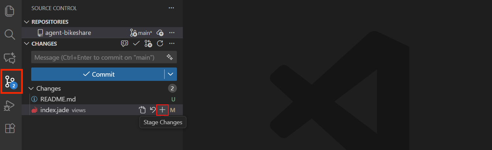
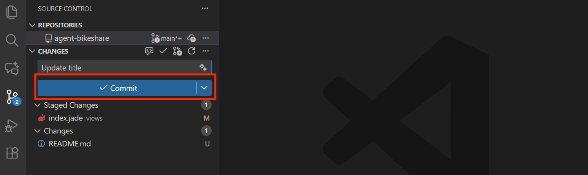

# Your First Repository

We'll create a repository on GitHub, bring it down to your laptop, make a
change, and publish it back.

## Create the repository on GitHub

1. Go to [github.com](https://github.com) and click the **+** in the top
   right, then **New repository**.

   

2. Name it `workshop-notes`.
3. Leave it **Public** (so your partner can find it later).
4. Check **Add a README file**.
5. Click **Create repository**.

You now have a repository that exists only on GitHub's servers. Next we bring
it down to your computer.

## Clone it into VS Code

1. Open VS Code.
2. Press `Cmd + Shift + P` (Mac) or `Ctrl + Shift + P` (Windows) to open the
   Command Palette, type `Git: Clone`, and select it.
3. Choose **Clone from GitHub**. If prompted, sign in (see
   [Setup](02-setup.md#5-sign-in-to-github-inside-vs-code)).
4. Find and select the repository you just created (e.g. `workshop-notes`).
5. Create or select a folder inside your home folder. You choose the folder
   name, for example, `Repos`. With that name, the path would be
   `/Users/your-username/Repos` on macOS or `C:\Users\your-username\Repos`
   on Windows. Keep this folder outside iCloud Drive, OneDrive, Dropbox, or other cloud
   sync folders, including Desktop or Documents if they're synced.
6. When VS Code asks if you'd like to open the cloned repository, click **Open**.

You now have a local copy, connected to the one on GitHub.

## Make a change

1. In the file explorer on the left, click `README.md` to open it.
2. Add a line about yourself — who you are, what you're working on, whatever
   feels natural. Save the file (`Cmd + S` on Mac or `Ctrl + S` on Windows).


## Commit and push

1. Click the **Source Control** icon in the left sidebar (looks like a branch
   of three connected circles — or press `Ctrl + Shift + G`).
2. You'll see `README.md` listed under **Changes**. Hover over it and click
   the **+** to stage it.

   

3. In the message box at the top, write a short commit message, e.g.
   `Add intro to README`.
4. Click the **Commit** button.

   

5. Click **Sync Changes** to pull any updates from GitHub and push your commit.

   

## Confirm it worked

Go back to your repository's page on GitHub.com and refresh. You should see
your change in `README.md`, and a commit history showing your message.

<details>
<summary>Optional: Markdown formatting and Terminal commands</summary>

`.md` files use Markdown for headings, tables, and more. Explore the
[Markdown syntax guide](https://www.markdownguide.org/basic-syntax/).

To stage, commit, and push from the Terminal inside your repository folder:

```sh
git add README.md
git commit -m "Add intro to README"
git push
```

If you've already completed the steps above, your change is already published.
Try these commands the next time you edit and save a file.

</details>

---

Next: [4. Pair Exercise — Fork and Pull Request](04-pair-exercise.md).
