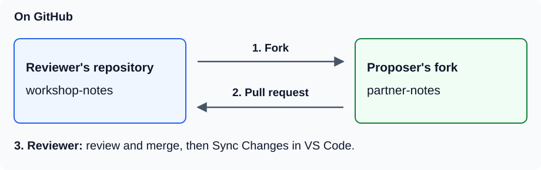
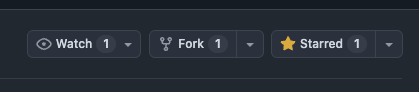
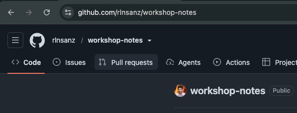
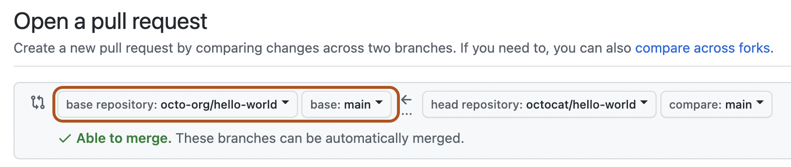
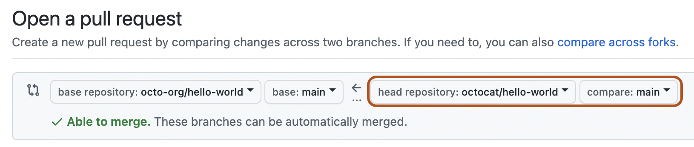
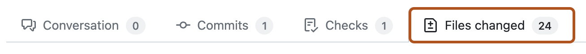
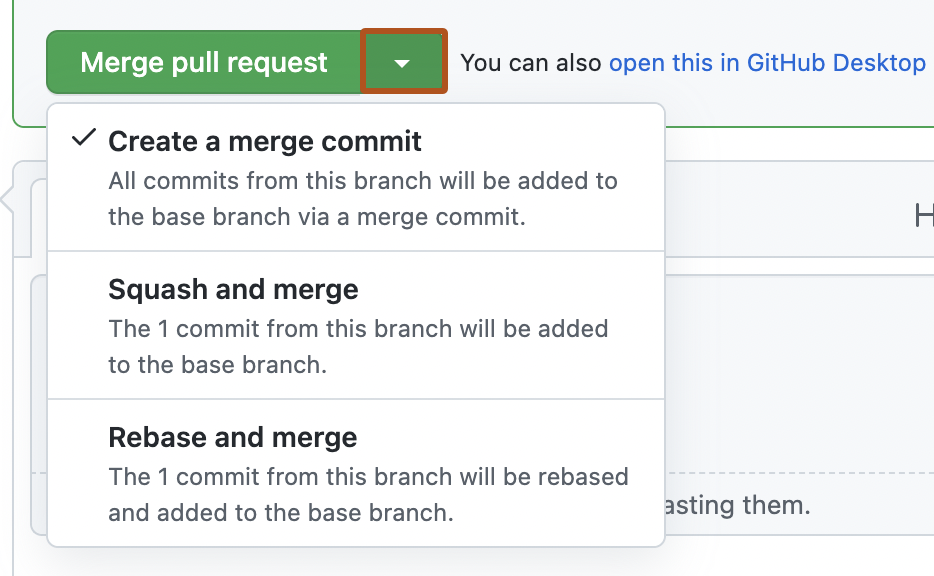
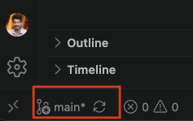

# Pair Exercise: Fork and Pull Request

Find a partner near you. Together, you'll propose, review, and merge **one pull
request** using the repositories you created in
[Your First Repository](03-first-repo.md).

**Allow 30 minutes. By the end, you'll have merged a note into one partner's
repository and opened the updated README together in VS Code.**

## Choose your roles

You and your partner take one role each. Pick roles, or flip a coin:

- **Proposer:** fork the reviewer's repository, make a change, and open a pull request.
- **Reviewer:** share your repository, review the proposed change, merge it, and
  pull the result onto your laptop.

Use the proposer's laptop for steps 2–6, then the reviewer's for steps 7–8.
Follow along and talk through each step together. Keep the same roles for steps 1–8.



## 1. Share the reviewer's repository — together

To share your repository you share the URL (or web address) where that repo is hosted. On the reviewer's laptop:

1. Go to GitHub.com and open the `workshop-notes` repository you created in the
   previous exercise.
2. Share the address from your browser's address bar. It looks like
   `github.com/<user>/workshop-notes`, where `<user>` is the reviewer's GitHub
   username. Your partner can type it into their own browser, or you can send it
   by chat or email.

## 2. Fork it — proposer

1. Open the link your partner shared.
2. Click **Fork** (top right). Choose your own account as the **Owner**.

   

3. Set **Repository name** to `partner-notes`, then click **Create fork**.


## 3. Clone your fork into VS Code — proposer

1. Open **VS Code** on your laptop. Press `Cmd + Shift + P` (Mac) or
   `Ctrl + Shift + P` (Windows) to open the Command Palette, then choose
   `Git: Clone` → **Clone from GitHub**.
2. Select **your-username/partner-notes**.
3. Choose your repositories folder (e.g. `Repos`). VS Code creates a new
   `partner-notes` folder inside it. Click **Open** when prompted.

Stay on `main`, the branch opened by default. Your fork keeps your edits
separate from your partner's repository until they merge your pull request.

## 4. Make a change — proposer

Open `README.md` and add a short note to your partner, for example:

```markdown
## Note from Alice
Thanks for sharing! What are you working on next?
```

Use a greeting and write your own message. Save the file.

## 5. Commit and push — proposer

   

1. In **VS Code**, click **Source Control** in the left sidebar (the icon with three connected circles).
2. Under **Changes**, hover over `README.md` and click **+** to stage it: select it for your next commit.
3. In the message box at the top, write `Add a note for my partner`, then click **Commit** to save a checkpoint.
4. Click **Sync Changes** to push your commit to your `partner-notes` fork on GitHub.

## 6. Open a pull request — proposer

1. Open the **reviewer's `workshop-notes` repository** on GitHub. Click the
   **Pull requests** tab near the top of the page.

   

   Then click **New pull request → compare across forks**.
2. Choose where the change goes (**base**) and where it comes from (**head**):

   | Selector | Choose |
   |---|---|
   | base repository | `reviewer-username/workshop-notes` |
   | base branch | `main` |
   | head repository | `your-username/partner-notes` |
   | compare branch | `main` |

   Both branches are called `main`, but they belong to different repositories.

   The screenshots highlight the selectors; use the names in the table above.

   

   

3. Add a title and description, then click **Create pull request**.

Because you added the note in your fork, the **pull request** asks your partner to bring that change into their repository. This is a very common way of sharing improvements and fixes on GitHub, and the backbone of open source contributions.

## 7. Review and merge — reviewer

On the reviewer's laptop, open your `workshop-notes` repository on GitHub.
Click **Pull requests** to find your partner's pull request (PR).

1. Open the PR and click **Files changed** to read your partner's note.

   

2. If you're happy with it, return to **Conversation** and scroll down. Click the
   dropdown arrow beside the green merge button and choose **Squash and merge**.
   Click the updated green button, keep the suggested commit message, then click
   **Confirm squash and merge**. This saves the pull request's changes as one commit.

   

## 8. Pull the merge down locally — reviewer

In VS Code, open your own `workshop-notes` folder from the previous exercise.
Switch to `main` using the branch selector at the bottom left, then click the
**Sync Changes** icon (the circular arrows beside it).



**Open `README.md` and find your partner's note. You've completed
a pull request as a pair!**

<details>
<summary>Finished early? Contribute to the workshop repository (optional)</summary>

Now each of you can propose a useful resource for journalists, researchers, or
social scientists to [the workshop repository](https://github.com/rlnsanz/github-tutorial).
Work on your own laptop and open one pull request each, then review each other's
recommendations.

1. Fork the workshop repository into your own GitHub account,
   keeping the name `github-tutorial`, and clone that fork into VS Code.
   Stay on the fork's default branch.
2. In VS Code's file explorer, open the `contributions` folder and create a file
   named `your-github-username.md`, replacing the placeholder with your username.
3. Add the resource's name, a link, and one sentence explaining why it's useful.
   See the [contribution example](../contributions/README.md).
4. Save, stage, commit, and click **Sync Changes**, as in step 5 above.
5. Open a pull request with `rlnsanz/github-tutorial` as the base repository and
   its default branch as the base branch. Select your fork as the head repository
   and its default branch as the compare branch. Give the PR a title such as
   `Recommend a resource: <resource name>`.
6. Swap PR links with your partner. Open their PR's **Files changed** tab and
   check their recommendation and link. Return to **Conversation**, write a
   short comment, and click **Comment**.
7. Show the PR to a facilitator, who can review and merge it. You don't need to
   wait for the merge to finish this optional exercise.

</details>

---

When you're ready, [continue to the next section](05-troubleshooting.md).
